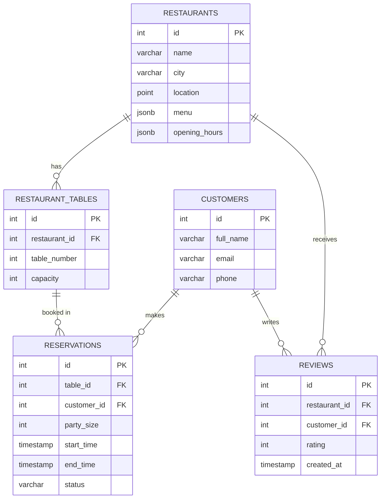

# ER Diagram

```mermaid
erDiagram
    RESTAURANTS ||--o{ RESTAURANT_TABLES : has
    RESTAURANTS ||--o{ REVIEWS : receives
    CUSTOMERS ||--o{ RESERVATIONS : makes
    CUSTOMERS ||--o{ REVIEWS : writes
    RESTAURANT_TABLES ||--o{ RESERVATIONS : "booked in"

    RESTAURANTS {
        int id PK
        varchar name
        varchar city
        point location
        jsonb menu
        jsonb opening_hours
    }
    RESTAURANT_TABLES {
        int id PK
        int restaurant_id FK
        int table_number
        int capacity
    }
    CUSTOMERS {
        int id PK
        varchar full_name
        varchar email
        varchar phone
    }
    RESERVATIONS {
        int id PK
        int table_id FK
        int customer_id FK
        int party_size
        timestamp start_time
        timestamp end_time
        varchar status
    }
    REVIEWS {
        int id PK
        int restaurant_id FK
        int customer_id FK
        int rating
        timestamp created_at
    }
```

Long review text is stored in MongoDB, linked by `review_id`.
